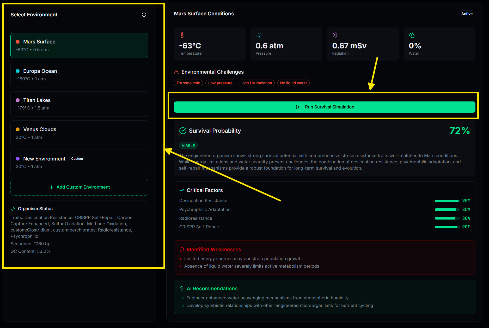
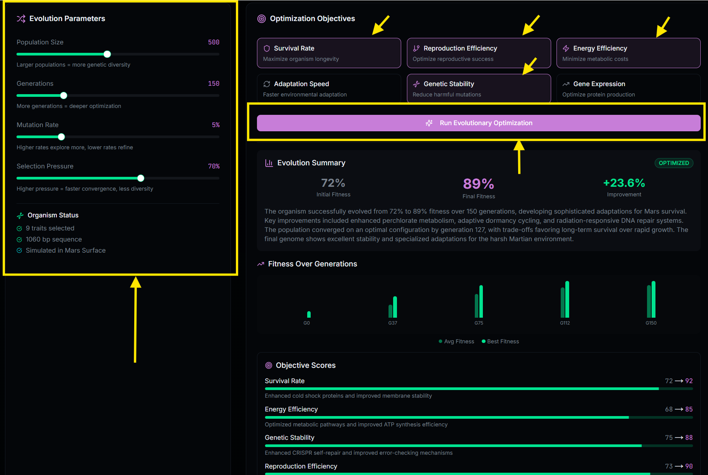
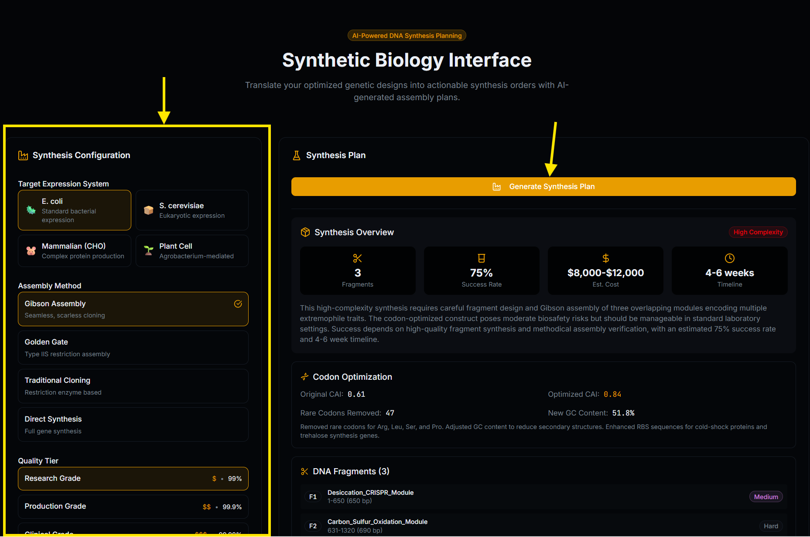
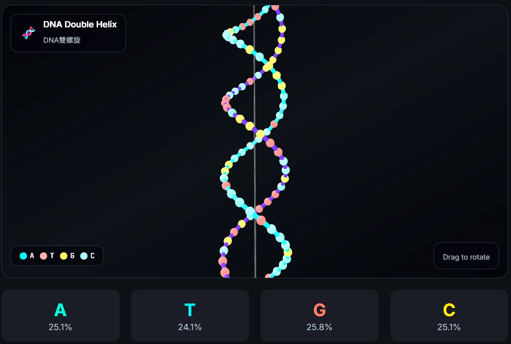
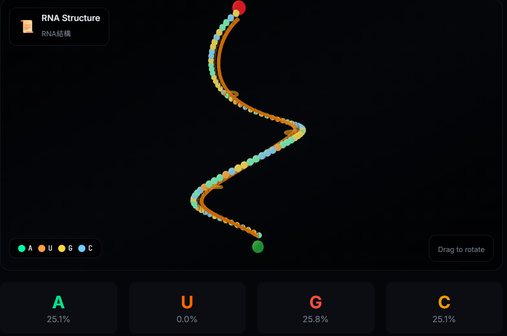
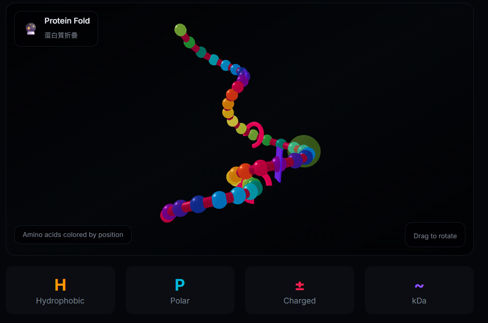
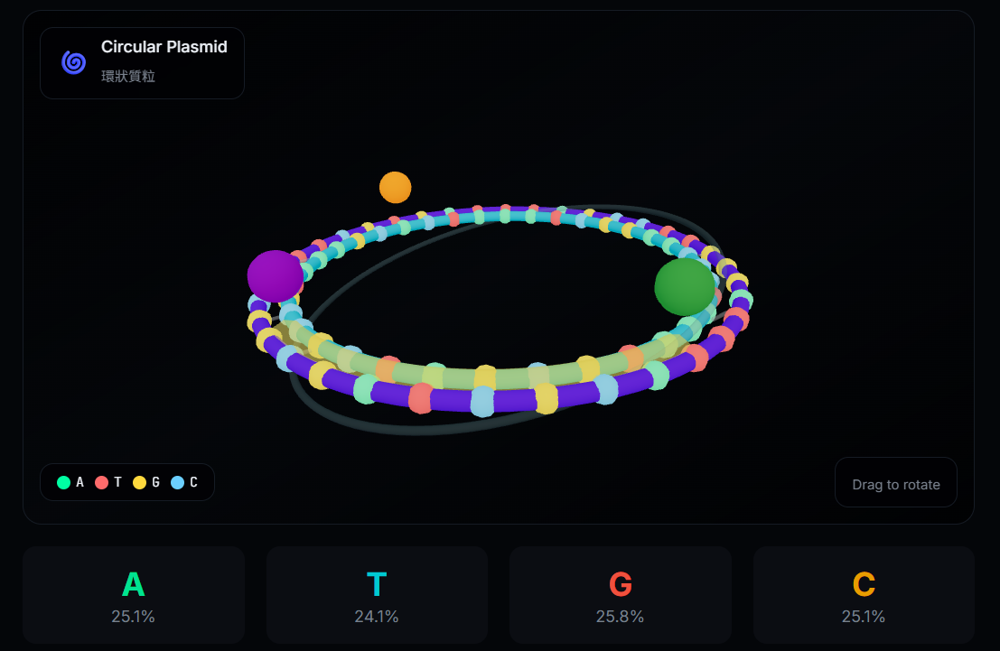

# Digital Arboretum 🧬

<p align="center">
  <strong>An AI-powered synthetic biology platform for designing life from code.</strong>
</p>

<p align="center">
  
  
  
  
  
  
</p>

---

## 🌟 Overview

Digital Arboretum bridges computational biology and synthetic life. Design chimeric organisms by combining traits from bacteria, plants, fungi, marine life, and more — then simulate their survival in extreme planetary environments like Mars, Europa, and Titan.

The platform uses **Claude Sonnet 4** to intelligently generate realistic genetic sequences (DNA, RNA, proteins, or plasmids) based on selected biological traits, with real-time 3D visualization powered by Three.js.

---

## 🎯 Problem Statement

Traditional synthetic biology tools face several challenges:

- **Accessibility Gap** — Designing genetic sequences requires deep expertise in molecular biology, limiting participation to specialists
- **Visualization Limitations** — Most tools lack intuitive 3D representations of genetic structures, making it difficult to understand complex biological constructs
- **Disconnected Workflows** — Existing platforms separate trait selection, sequence generation, environmental simulation, and synthesis planning into isolated tools
- **Educational Barriers** — Learning synthetic biology concepts is abstract without interactive, visual feedback systems
- **Extraterrestrial Biology Gap** — No accessible tools exist for exploring organism design for extreme planetary environments

---

## 🏁 Aims & Objectives

### Aim

To develop an AI-powered, interactive platform that democratizes synthetic biology design by enabling users to create, visualize, simulate, and plan the synthesis of chimeric organisms through an intuitive interface.

### Objectives

1. **Create an Intuitive Trait Selection System**
   - Curate 70+ biological traits with scientific references across 10 categories
   - Enable custom trait creation through natural language descriptions

2. **Implement AI-Driven Sequence Generation**
   - Leverage Claude Sonnet 4 for realistic DNA, RNA, protein, and plasmid generation
   - Automatically detect appropriate output structure based on trait combinations

3. **Develop Real-Time 3D Visualization**
   - Build interactive 3D models for DNA helices, RNA strands, proteins, and plasmids
   - Provide immediate visual feedback during the design process

4. **Build Planetary Environment Simulation**
   - Simulate organism viability on Mars, Europa, Titan, and Venus
   - Provide AI-powered survival analysis and adaptation recommendations

5. **Create Evolutionary Optimization Tools**
   - Implement genetic algorithms for multi-generational fitness optimization
   - Track emergent traits and evolutionary trade-offs

6. **Design Synthesis Planning Interface**
   - Generate actionable DNA assembly plans with codon optimization
   - Support multiple assembly methods (Gibson, Golden Gate, Traditional Cloning)

---

## ✨ Features

### 🧬 AI DNA Designer
- **73+ biological traits** across 10 categories:
  - 🦠 Extremophile (thermophilic, radioresistance, psychrophilic, etc.)
  - 🌱 Plant (C4/CAM photosynthesis, nitrogen fixation, drought resistance)
  - 🐙 Marine (bioluminescence, pressure adaptation, chromatophores)
  - 🦋 Insect (exoskeleton, compound eyes, metamorphosis, flight muscles)
  - 🍄 Fungal (mycelium networks, lignin decomposition, spore dormancy)
  - ⚗️ Synthetic (biosensors, bioplastics, CRISPR self-repair, kill switches)
  - 🐾 Animal (limb regeneration, spider silk, echolocation, hibernation)
  - ⚡ Chemosynthetic (sulfur/iron/hydrogen/methane oxidation)
  - 🛡️ Immune Defense (CRISPR immunity, antimicrobial peptides, oxidative burst)
  - 🧠 Neural/Sensory (electroreception, distributed neural networks, magnetoreception)
- **Custom trait creation** — describe any trait and AI generates the genetic sequence
- **Smart structure detection** — automatically outputs DNA, RNA, Protein, or Plasmid based on selected traits
- **Real-time 3D visualization** with React Three Fiber

### 🌍 Planetary Environment Simulator
- Simulate organism survival on **Mars**, **Europa**, **Titan**, and **Venus**
- AI analyzes trait-environment compatibility
- Detailed survival probability with critical factors and adaptation recommendations

### 🔄 Evolutionary Optimizer
- Genetic algorithm simulation across **100–500 generations**
- Configurable population size, mutation rate, and selection pressure
- Track fitness history, emergent traits, and evolutionary trade-offs

### 🧪 Synthesis Interface
- Generate real-world DNA synthesis plans
- Codon optimization for target expression systems (E. coli, Yeast, Mammalian, Plant)
- Assembly methods: Gibson Assembly, Golden Gate, Traditional Cloning
- Risk assessment and vendor recommendations

### 💬 AI Chat Assistant
- Integrated chat widget powered by Claude for questions about your organism design
- Context-aware responses based on selected traits

---

## 🛠️ Tech Stack

| Category | Technology |
|----------|------------|
| **Framework** | Next.js 16 (App Router) |
| **Language** | TypeScript 5 |
| **UI** | React 19 + Tailwind CSS 4 |
| **Components** | Radix UI + shadcn/ui |
| **3D Graphics** | Three.js r181 + React Three Fiber 9 |
| **AI** | Claude Sonnet 4 (Anthropic SDK) |
| **Charts** | Recharts |
| **Analytics** | Vercel Analytics |
| **Fonts** | Inter + JetBrains Mono |

---

## 🚀 Getting Started

### Prerequisites

- **Node.js 18+** (LTS recommended)
- **npm**, **yarn**, **pnpm**, or **bun**
- **Anthropic API key** for Claude AI

### Installation

1. **Clone the repository**
   ```bash
   git clone <repository-url>
   cd Embodied-Cognition-Digital-Arboretum
   ```

2. **Install dependencies**
   ```bash
   npm install
   # or: yarn install | pnpm install | bun install
   ```

3. **Set up environment variables**
   
   Create a `.env.local` file in the root directory:
   ```env
   ANTHROPIC_API_KEY=your_anthropic_api_key_here
   ```

4. **Run the development server**
   ```bash
   npm run dev
   ```

5. **Open your browser**
   
   Navigate to [http://localhost:3000](http://localhost:3000)

---

## 📁 Project Structure

```
embodied_cognition/
├── app/
│   ├── api/
│   │   ├── chat/           # AI chat endpoint
│   │   ├── evolve/         # Evolutionary optimization
│   │   ├── generate-dna/   # DNA/RNA/Protein generation
│   │   ├── simulate/       # Environment simulation
│   │   └── synthesize/     # Synthesis planning
│   ├── globals.css         # Dark biotech theme (OKLCH colors)
│   ├── layout.tsx          # Root layout with providers
│   └── page.tsx            # Main application page
├── components/
│   ├── chat-widget.tsx           # AI assistant chat
│   ├── dna-designer.tsx          # Main trait selector interface
│   ├── dna-helix.tsx             # 3D DNA helix animation
│   ├── dna-sequence-3d.tsx       # 3D sequence visualization
│   ├── environment-simulator.tsx # Planetary simulation
│   ├── evolutionary-optimizer.tsx
│   ├── features-section.tsx
│   ├── genetic-structure-3d.tsx  # DNA/RNA/Protein 3D models
│   ├── hero-section.tsx
│   ├── navigation.tsx
│   ├── synthesis-interface.tsx
│   ├── trait-info-dialog.tsx     # Scientific references popup
│   ├── trait-visualizer-3d.tsx   # 3D trait preview
│   └── ui/                       # shadcn/ui components
├── lib/
│   ├── organism-context.tsx      # Global state (React Context)
│   ├── traits-data.ts            # 73+ trait definitions with references
│   └── utils.ts                  # Utility functions
└── public/
```

---

## 🔬 How It Works

```
┌─────────────┐    ┌──────────────┐    ┌─────────────────┐
│   Design    │───▶│   Generate   │───▶│    Simulate     │
│ Select 73+  │    │ Claude AI    │    │ Mars/Europa/    │
│   traits    │    │ creates DNA  │    │ Titan/Venus     │
└─────────────┘    └──────────────┘    └─────────────────┘
                          │
                          ▼
              ┌──────────────────────┐
              │       Evolve         │
              │ Genetic algorithm    │
              │ optimizes fitness    │
              └──────────────────────┘
                          │
                          ▼
              ┌──────────────────────┐
              │     Synthesize       │
              │ Real-world DNA       │
              │ assembly plans       │
              └──────────────────────┘
```

1. **Design** — Select biological traits from 10 categories or create custom traits
2. **Generate** — Claude AI creates realistic genetic sequences (DNA/RNA/Protein/Plasmid)
3. **Simulate** — Test organism viability in extreme planetary environments
4. **Evolve** — Run evolutionary optimization over generations
5. **Synthesize** — Generate actionable DNA synthesis plans for lab work

---

## 📸 Screenshots & Demos

### 🎬 DNA Designer Interface
https://github.com/user-attachments/assets/a2bc387a-7c54-43b5-a97d-8eea69df5497
<p align="center">
  <video src="short_video_image/DNA_designer.mp4" controls width="700" autoplay loop muted>
    Your browser does not support the video tag.
  </video>
</p>

<p align="center">
  <em>Interactive DNA Designer with trait selection and real-time 3D visualization</em>
</p>

### 🎬 Trait Information Dialog
https://github.com/user-attachments/assets/5975022d-cb8f-42d4-9bd7-9561bf7140df
<p align="center">
  <video src="short_video_image/traits_info.mp4" controls width="700" autoplay loop muted>
    Your browser does not support the video tag.
  </video>
</p>

<p align="center">
  <em>Scientific references and detailed trait information with bilingual support</em>
</p>

### 🌍 Planetary Survival Simulation

<p align="center">
  
</p>

<p align="center">
  <em>Test organism viability on Mars, Europa, Titan, and Venus with AI-powered analysis</em>
</p>

### 🔄 Evolutionary Optimizer

<p align="center">
  
</p>

<p align="center">
  <em>Run genetic algorithms across 100-500 generations with real-time fitness tracking</em>
</p>

### 🧪 Synthesis Interface

<p align="center">
  
</p>

<p align="center">
  <em>Generate real-world DNA synthesis plans with codon optimization and assembly methods</em>
</p>

---

## 🧬 3D Genetic Structure Visualizations

The platform automatically determines the output structure type based on selected traits. Each visualization is scientifically accurate with distinct 3D features:

| Structure | Icon | 3D Features |
|-----------|------|-------------|
| **DNA** | 🧬 | Double helix, base pairs (A-T, G-C), two phosphate backbones |
| **RNA** | 📜 | Single strand, hairpin loops, 5'/3' end markers |
| **Protein** | 🔮 | Folded polypeptide chain, alpha helices, beta sheets, active site |
| **Plasmid** | 🌀 | Circular DNA, oriC marker, antibiotic resistance gene, MCS region |

### Structure Preview Gallery

<p align="center">
  
  
</p>
<p align="center">
  
  
</p>

### Trait Combinations → Structure Examples

The AI automatically selects the appropriate genetic structure based on your trait selections:

| Traits Selected | Output Structure |
|-----------------|------------------|
| **Thermophilic** + **Biosensor (Arsenic)** | 🌀 Plasmid — Bacterial/synthetic constructs for engineered expression |
| **Exoskeleton** + **Venom Synthesis** | 🔮 Protein — Structural proteins and enzyme complexes |
| **Rapid Cell Division** + **Metamorphosis** | 📜 RNA — Gene expression and developmental regulation |
| **Pressure Adaptation** + **Salinity Tolerance** | 🧬 DNA — Genomic constructs for complex adaptations |

**More Examples:**

- 🌀 **Plasmid**: Radioresistance + CRISPR Self-Repair → *Engineered radiation-resistant bacterial vector*
- 🌀 **Plasmid**: Halophilic + Genetic Kill Switch → *Biosafety-controlled extremophile expression system*
- 🔮 **Protein**: Spider Silk + Antifreeze Proteins → *Structural fusion protein with cold adaptation*
- 🔮 **Protein**: Bioluminescence + Electric Organ → *Multi-functional marine-derived protein complex*
- 📜 **RNA**: C4 Photosynthesis + Mycelium Network → *Regulatory mRNA for metabolic pathways*
- 📜 **RNA**: Deep Root System + Nitrogen Fixation → *Plant developmental signaling transcript*
- 🧬 **DNA**: Pressure Adaptation + Electroreception → *Genomic cassette for deep-sea sensory system*

---

## 🎯 Use Cases

| Domain | Application |
|--------|-------------|
| **Astrobiology Research** | Design organisms for space colonization scenarios |
| **Synthetic Biology Education** | Learn genetic engineering concepts interactively |
| **Speculative Design** | Explore chimeric organism possibilities |
| **Bioart Projects** | Create fictional organisms with scientific grounding |
| **Rapid Prototyping** | Generate starting sequences for real lab work |

---

## 🎨 Design Philosophy

Digital Arboretum features a **dark biotech aesthetic** with bioluminescent green accents, inspired by:
- Deep-sea organisms and hydrothermal vent ecosystems
- Laboratory interfaces and bioinformatics tools
- Modern IDE color schemes (OKLCH color space)

The UI prioritizes:
- Scientific accuracy with peer-reviewed references for each trait
- Real-time 3D feedback as you design
- Bilingual support (English + Traditional Chinese trait names)

---

## 📚 Trait Database

Each trait in the database includes:
- **Scientific name and gene identifiers**
- **Source organism** (e.g., *Deinococcus radiodurans*, *Tardigrade*)
- **Molecular mechanism** explanation
- **Peer-reviewed references** (Wikipedia, NCBI, Nature, etc.)
- **Bilingual naming** (English + Traditional Chinese)

Example trait entry:
```typescript
{
  name: "Radioresistance",
  description: "Withstands 5,000+ Gy radiation via efficient DNA repair",
  gene: "RecA/DdrB",
  chineseName: "耐輻射",
  source: "Deinococcus radiodurans",
  mechanism: "Multiple genome copies + enhanced RecA-mediated repair",
  references: [/* Wikipedia, NCBI, Nature papers */]
}
```

---

## 📄 License

Created for the **Cursor Hackathon** 🏆

---

## 🙏 Acknowledgments

- [Anthropic](https://anthropic.com) — Claude AI
- [Vercel](https://vercel.com) — Next.js framework
- [shadcn/ui](https://ui.shadcn.com) — Component library
- [React Three Fiber](https://docs.pmnd.rs/react-three-fiber) — 3D rendering
- Scientific trait data sourced from peer-reviewed research

---

<p align="center">
  <strong>Bridging code and biology</strong> 🧬✨
</p>
